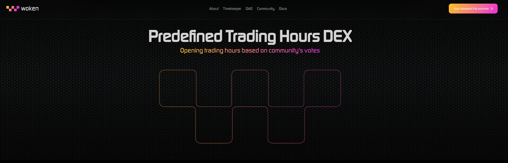
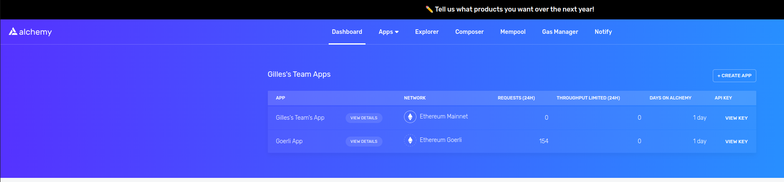
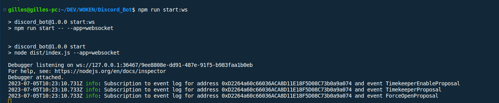
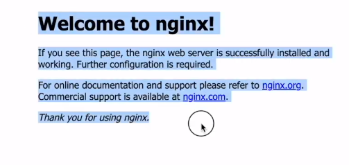
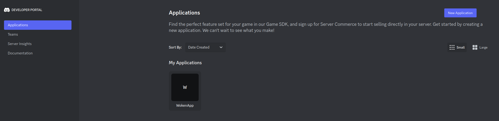
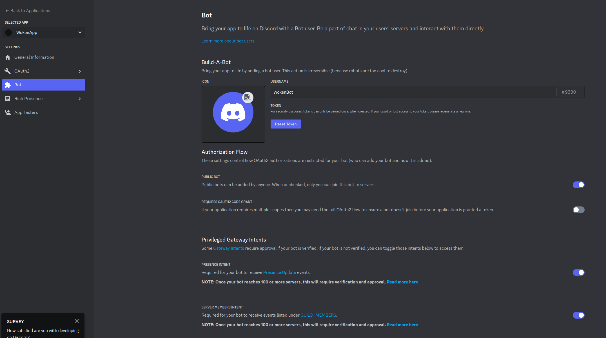
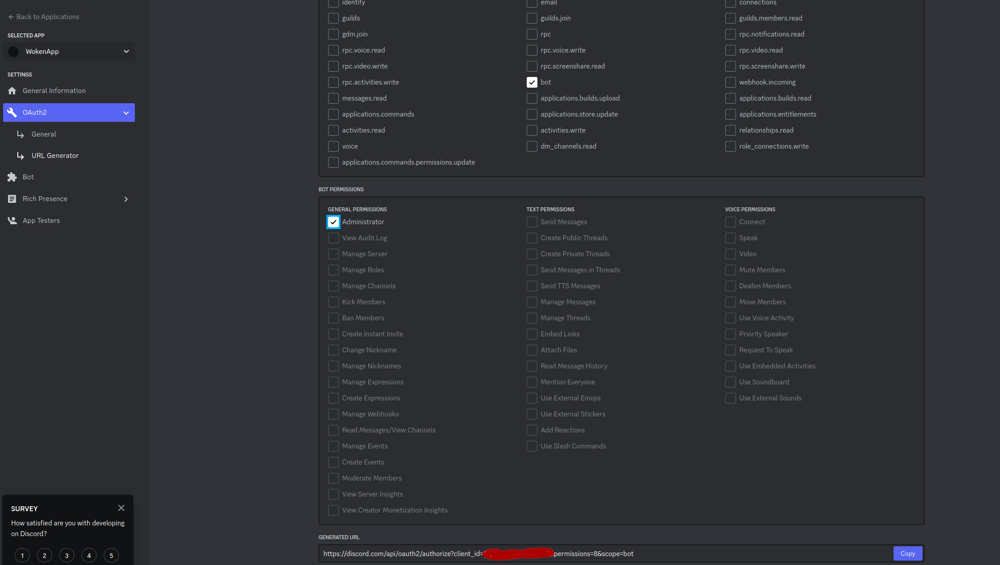

# Introduction

This tool aims at listening the smart contracts of https://woken.exchange/ <br>
and push notifications in Discord channels on specific events on the smart contract





# Prerequisite


You must have : 
 - node
 - npm

installed on your host to run the app locally

# Settings

## Node dependencies

To install dependencies, just run the following command :

```sh
npm install
```


# Addresses

Useful to do some tests and create LP pair
## Goerli TestNet

### WKN Token 

0x841699991e4129BA98385f50CDc4235CdF4A9397

### USDC

0xE06B56Fc1E19402E1a9DF3513E024a3b9847c9E5

# Ways to listen smartc contract events

## Solution 1 : Websocket

In order to listen smart contract event, we can implements websocket.<br>
This solution was chosen and it works on production.<br>
The selected JS library to communicate with the blockchain is _Alchemy-SDK_ based on the famous _ethers.js_ library.

some steps are required to make work the bot that send notifications to the wanted Discord channel.

### Step 1 : Alchemy Account

Create an account on Alchemy and create an app for the network you want to run the bot (Mainnet, TestNet)



After that, you can get your Alchemy key/auth token that will be used for websockets

### Step 2 : Webhook in the discord channel

If you want to send notifications on a specific channel in Discord, you will have to create a Webhook on this channel.<br>
To do that, you can refer to this video : https://www.youtube.com/watch?v=fKksxz2Gdnc
<br>
After that, you will have a signed URL (URL with secret token) 
which can be used to send notiifctations

### Step 3 : Edit the _.env_ file

Edit the _.env_ file and fill the _ALCHEMY_API_KEY_ key in this file
You will need to fill other required keys like _DISCORD_WEBHOOK_URL_ that is the URL provided by Discord when you created a Webhook on a channel.<br>
The address of your factory smart contract is required as well. Fill it in _FACTORY_ADDRESS_ key

### Step 4 : Compile the project

```sh
npm run build
```

### Step 4 : Run the project

```sh
npm run start:ws
```

You will see in the console these logs



meaning that your websockets arre listening these events and are ready to send notifications if needed !!

## Solution 2 : Alchemy Notify Service

==> TODO later


# Deploy App on Amazon EC2 

Remarks : Useful for the Solution 2 (Alchemy Notify Service) ==> Not used right now to listen smart contract !!

## Step 1 : Create a free Ubuntu EC2 instance on AWS

Once created on AWS dashboard. Connect to it with SSH

## Step 2 : Use 'root' user

```sh
sudo su
```

## Step 3 : Install Curl

```sh
apt install curl
```

## Step 4 : Install NVM

```sh
curl https://raw.githubusercontent.com/creationix/nvm/master/install.sh | bash
```

Then 

```sh
source ~/.bashrc
```

## Step 5 : Install Node using NVM

```sh
nvm install node
```

To install a specific version : 

```sh
nvm install 18.16.0 
```

## Step 6 : Install Git

```sh
apt update
```

then : 

```sh
apt install git-all
```
## Step 7 : Install PM2

```sh
npm install pm2 -g
```


## Step 8 : Clone the repository

```sh
git clone https://github.com/gilbruno/Woken_Discord_Bot.git
```

## Step 9 : Install node deps

```sh
npm install
```

## Step 10 : Compile the app

```sh
npm run build
```

## Step 11 : Create security rule to open HTTP for the right port

Do it in AWS EC2 in _Security Groups_
==> Open protocols and ports you need (SSH, TCP, TCP Custom, etc ...)

## Step 12 : Create an Elastic IP and associate with your EC2 instance

This step is important to keep a fix IP and associate with a DNS
==> See AWS tuto for this

## Step 13 : Install NGINX

This step is important to do a reverse proxy from NGINX to your NodeJS App
As the port 80 is the port by default of Nginx, we do not need to specify a port in the URL
So the URL without port will be able to be associated to tthe port 3000 of your app

```sh
apt install nginx
```

then launch the elastic IP in the URL without any port (80 by default)

Ex : http://13.49.112.85/

You must see this



If you see Apache.
Apache is installed by default on your server.
You must uninstall it and restart Nginx

## Step 14 : Configure reverse Proxy

Edit the following file : 

```
nano /etc/nginx/sites-available/default
```

In the _location_ block, write this : 

```
location / {
    proxy_pass http://localhost:3000; #whatever port your app runs on
    proxy_http_version 1.1;
    proxy_set_header Upgrade $http_upgrade;
    proxy_set_header Connection 'upgrade';
    proxy_set_header Host $host;
    proxy_cache_bypass $http_upgrade;
}
```

On the _root_ line, write the directory of your NodeJS app

```
root /home/ubuntu/woken/Woken_Discord_Bot;
```

Reload configuration :

```sh
nginx -t
```

Restart Nginx :

```sh
service nginx restart
```

Now you must see the home page of your NodeJS app 
when launching the elastic IP of your EC2 instance in browser !!
And not the homepage of Nginx !


##  Remarks

To connect to your EC2 with SSH : 

```sh
ssh -i <path_to_your_pem_file_key> ec2-user@<IP_EC2_Instance>
```


# Discord

## Introduction 

In this app, we only use a web hook to send notifications to a channel.
But this app can be used to implements a Discord Bot.<br>
To do this, some steps are required in the _Discord_ developer portal.<br>
Anyway, a little implementation of a Discord Bot than can be logged to a server was implemented in this app.<br>
So, we an go further to implements more complexe features with a bot.
Code is here !


## Insctructions

Connect to the _Discord Developer Portal_ on the URL : _https://discord.com/developers_.<br>
If you have a Discord account, you will be connected with this account automatically.

### Create an App

Use the left menu for that



### Create a Bot

Use the left menu for that.
The token will be used to login your bot to a server.



You must Grant  all _Privileged Gateway Intents_ : 

 - PRESENCE INTENT
 - SERVER MEMBERS INTENT
 - MESSAGE CONTENT INTENT


### Add a bot to a server

In order to do that, you will run a endpoint (HTTP Request) to add your bot to the server you want.
Even if you are not the administrator of the server.<br>
So, you must generate the URL endpoint.<br>
To do that, go to _OAuth2 > URL Generator_.<br>
Then, in _SCOPES_ block, select _bot_ and in _BOT PERMISSIONS BOT_ select _Administrator_.<br>
After selecting these 2 values, the _GENERATED URL_ appears in the bottom of the page.<br>
Like below :



Ex : https://discord.com/api/oauth2/authorize?client_id=<My_Client_Id>&permissions=8&scope=bot

When execute this URL in a browser, the UI will suggest you all the server where you have _admin_ role : 
 - on a server
 - on at least one channel where you have _admin_ roles or enough big roles.

If you choose a Discord server where you are an admin, you will get a notification to add/grant the new Bot on your server.
If you choose a Discord server where you are an admin, the Discord server admn will be notified that someone wants to add a bot on his/her server.
Once the bot added/granted in the server, you will be able to login your bot to this server.


